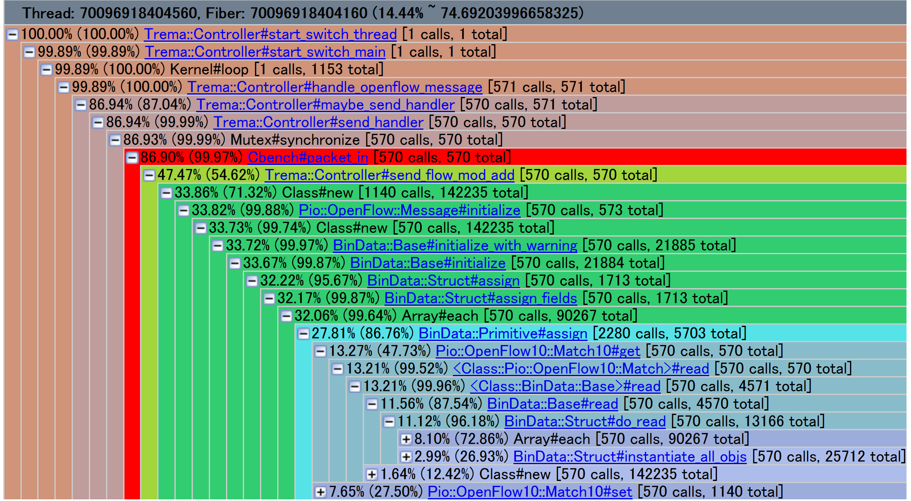
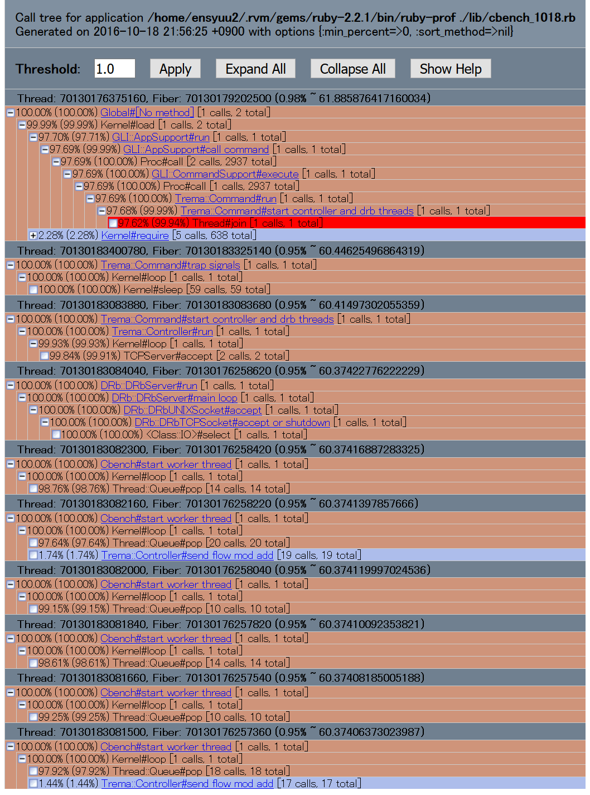

#Cbenchのボトルネック調査
今回はruby-profを用いてプログラムの解析を行う．
まずは基本的なプログラムである./lib/cbench.rbを解析する．
このプログラムは単純にpacket_inハンドラの中に，flow_modを追加する内容が記述されている．
このプログラムによって追加されたパケットの返送設定によって返送されたパケットの数がcbenchによってカウントされることとなる．

まず，タスクの稼働方法は
'ruby-prof -p call_stack -f call_stack.html ~/.rvm/gems/ruby-2.2.1/bin/trema run ./lib/cbench.rb'
となる．call_stackという出力方法により，html形式で解析しやすくした．

##cbench.rbのcbench結果
cbenchの結果は次のようになる．
'''
1   switches: fmods/sec:  143   total = 0.014146 per ms
1   switches: fmods/sec:  97   total = 0.009648 per ms
1   switches: fmods/sec:  66   total = 0.006587 per ms
1   switches: fmods/sec:  85   total = 0.008399 per ms
1   switches: fmods/sec:  65   total = 0.006464 per ms
'''
##cbench.rbの解析結果
解析結果が次のようになる．

##結論
この結果を見ると，Mutex#synchronizeと記述されている部分に，使用していないにもかかわらずmutexによる負担が大きいことが少なくとも分かった．これはつまり，ハンドラによって呼び出される関数はバックグラウンドで自動的にマルチスレッド処理を行っており，その際に自動的に排他的処理であるmutexを機能させていることから，ボトルネックの１つになっているのであると判断した．

しかし今回の対象プログラムでは，スレッドごと（流入パケットごと）の共有資源が存在しないため，mutexを行う必要がない．よってこのボトルネックは不必要なものであり，最適化するべきであることがわかる．

#Cbenchの高速化
前節で述べたように，このプログラムはいずれにせよマルチスレッド処理を行うことになるのであるから，もとから排他的処理を行わないマルチスレッド処理にすることとする．
プログラムは次のようにした．

##cbench_multi.rbのプログラムソース
	# A simple openflow controller for benchmarking.
	require "ruby-prof"
	class Cbench < Trema::Controller
	  def start(_args)
	    logger.info "#{name} started."
	    @work_queue = Queue.new
	    100.times{start_worker_thread}
	  end
	  def packet_in(datapath_id, packet_in)
	    @work_queue.push [datapath_id,packet_in]
	=begin
	    send_flow_mod_add(
	      datapath_id,
	      match: ExactMatch.new(packet_in),
	      buffer_id: packet_in.buffer_id,
	      actions: SendOutPort.new(packet_in.in_port + 1)
	    )
	=end
	  end
	  def start_worker_thread
	    Thread.new do
	      loop do
	        datapath_id, packet_in = @work_queue.pop
		send_flow_mod_add(
		  datapath_id,
		  match:ExactMatch.new(packet_in),
		  buffer_id: packet_in.buffer_id,
		  actions: SendOutPort.new(packet_in.in_port+1)
		)
	      end
	    end
	  end
	end
	
前節と同じように実行した．

##cbench_multi.rbのcbench結果
'''
1   switches: fmods/sec:  253   total = 0.025290 per ms
1   switches: fmods/sec:  224   total = 0.022280 per ms
1   switches: fmods/sec:  145   total = 0.014287 per ms
1   switches: fmods/sec:  156   total = 0.015574 per ms
1   switches: fmods/sec:  161   total = 0.016063 per ms
'''
上記のように，２倍程度に高速化されている．cbenchを使わない場合はどちらも５倍程度の速さであるが，cbench_multiのほうが速いことに変わりはなかった．

##cbench_multi.rbの解析結果

ruby-profによる解析結果はこのようになり，mutexの文字列は見当たらず，逆にスレッドがsleepをするほどになったので，ボトルネックは別の部分になったと言える．

